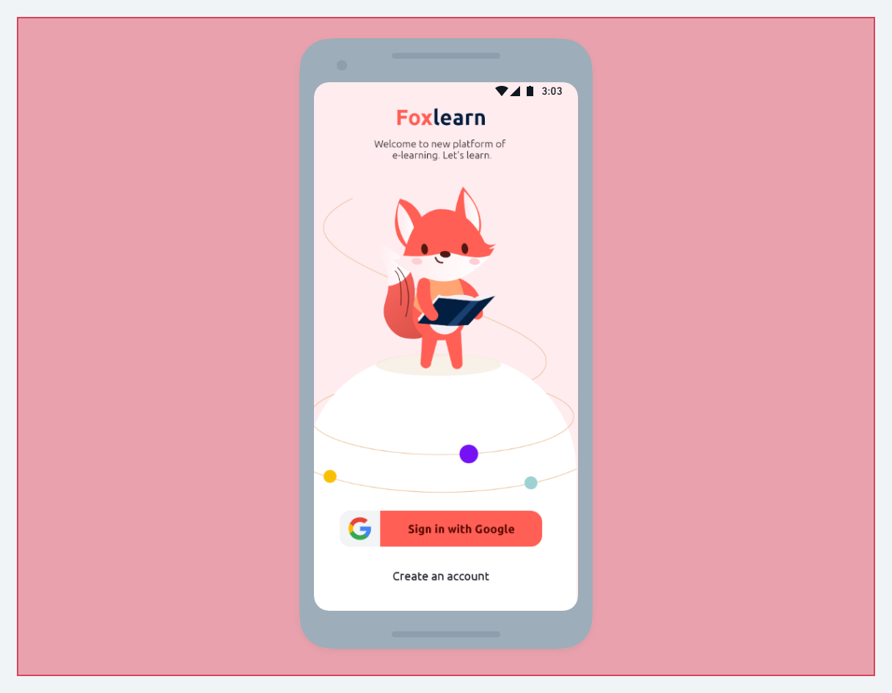

## Overview | :book:

A simple project, in order to implement a login with Google and persist the user state using the Redux library.

## Screenshots | 	:camera_flash:


[Image credits](https://dribbble.com/shots/9999705-Foxlearn)

---

## Techs | 🚀
- React Native;
- Typescript;
- Redux;
- [React Native Google Sign In](https://github.com/react-native-google-signin/google-signin);
- Firebase;
- Styled-Components.

## How to run | :hourglass:

#### 1. clone the repository

```bash
git clone https://github.com/johelder/login-google.git
```

#### 2. install dependencies

```bash
yarn
```

#### 3. run metro

```bash
yarn start
```

#### 4. install the app on your device/virtual device

```bash
yarn android
```

<p align="center">With 💜 by Johelder</p>

